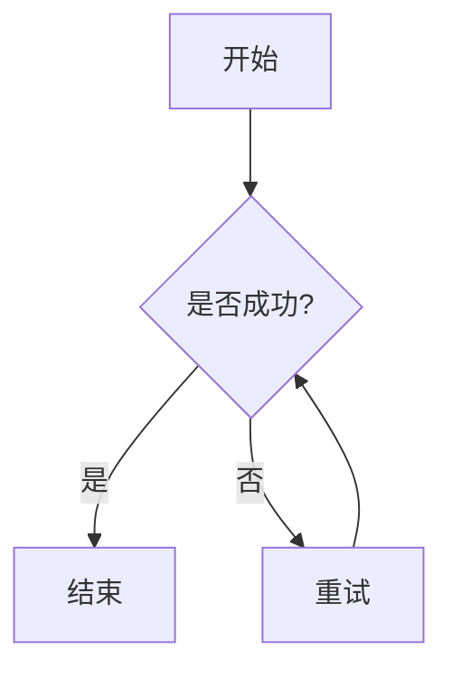

# MD Viewer - Chrome Markdown 预览插件

一个智能的 Chrome 浏览器扩展，能够自动检测并预览浏览器中打开的 Markdown 文件，支持源码与渲染视图的无缝切换。采用 Vite 构建，核心解析库本地化，Mermaid 图表支持在线加载。

## 📋 目录

- [功能特性](#功能特性)
- [项目结构](#项目结构)
- [环境要求](#环境要求)
- [快速开始](#快速开始)
- [使用说明](#使用说明)
- [配置说明](#配置说明)
- [开发指南](#开发指南)
- [常见问题](#常见问题)
- [技术栈](#技术栈)
- [许可证](#许可证)

---

## ✨ 功能特性

### 核心功能

- 🔍 **自动检测**：自动识别浏览器中打开的 `.md` 和 `.markdown` 文件
- 👁️ **实时预览**：即时渲染 Markdown 内容为美观的 HTML 页面
- 📝 **双模式切换**：一键在预览模式和源码模式之间切换
- 📋 **复制功能**：快速复制 Markdown 源码到剪贴板
- 💾 **下载功能**：下载原始 Markdown 文件
- 🔒 **安全防护**：使用 DOMPurify 防止 XSS 攻击
- 📑 **智能目录**：左侧自动生成导航栏，点击可平滑滚动定位
- ✏️ **实时编辑**：支持在线修改 Markdown 内容，并提供重置功能
- 📊 **Mermaid 支持**：自动渲染流程图、时序图等 Mermaid 图表（需联网）
- 🌓 主题切换：支持亮色/暗色模式一键切换，并自动记忆用户偏好

### 支持的 Markdown 语法

- ✅ 标题（H1-H6）
- ✅ 粗体、斜体、删除线
- ✅ 无序列表、有序列表、任务列表
- ✅ 代码块（行内和多行，支持语法高亮样式）
- ✅ 链接和图片
- ✅ 引用块
- ✅ 表格
- ✅ 分隔线
- ✅ 嵌套列表
- ✅ **Mermaid 图表**（流程图、甘特图、类图等）

### 用户体验

- 🎨 **现代化界面**：渐变色工具栏，清晰的视觉层次
- 📱 **响应式设计**：完美适配桌面端和移动端
- ⚡ **零配置**：安装即可使用，无需任何设置
- 🚀 **轻量级**：核心体积小，加载速度快

---

## 📁 项目结构

```
md-view/
├── package.json              # 项目配置文件（依赖、脚本等）
├── vite.config.js            # Vite 构建配置
├── README.md                 # 项目说明文档
├── public/                   # 静态资源目录
│   ├── manifest.json         # Chrome 插件清单文件
│   └── icons/                # 插件图标
│       ├── icon16.png        # 16x16 图标
│       ├── icon48.png        # 48x48 图标
│       └── icon128.png       # 128x128 图标
└── src/                      # 源代码目录
    ├── content.js            # 内容脚本（核心逻辑）
    └── content.css           # 样式文件
```

### 关键文件说明

| 文件 | 作用 | 说明 |
|------|------|------|
| `manifest.json` | 插件配置清单 | 定义插件权限、入口点、图标等 |
| `content.js` | 内容脚本 | 自动检测 .md 文件并渲染 |
| `content.css` | 样式文件 | 定义工具栏和预览界面样式 |
| `vite.config.js` | 构建配置 | 配置 Vite 打包输出 |
| `package.json` | 项目配置 | 管理依赖和构建脚本 |

---

## 💻 环境要求

### 系统要求

- **操作系统**：Windows 10/11, macOS, Linux
- **浏览器**：Google Chrome 88+ 或基于 Chromium 的浏览器（Edge, Brave 等）

### 开发环境

- **Node.js**：>= 16.0.0
- **npm**：>= 7.0.0 或 yarn >= 1.22.0

### 运行时依赖

本项目通过 `npm` 管理核心依赖，构建时会自动打包进扩展程序中：

- `marked@^11.1.0`：Markdown 解析器（本地打包）
- `dompurify@^3.0.6`：HTML sanitization 库（本地打包）
- `mermaid@10.x`：图表渲染库（**在线 CDN 加载**，以减小插件体积）

---

## 🚀 快速开始

### 1. 克隆或下载项目

```bash
# 如果从 Git 仓库克隆
git clone <repository-url>
cd md-view

# 或直接解压下载的项目文件夹
cd F:\Protest\chromeplug\md-view
```

### 2. 安装依赖

```bash
npm install
```

### 3. 构建项目

```bash
npm run build
```

构建完成后，会在项目根目录生成 `dist/` 文件夹，包含所有编译后的文件。

### 4. 加载到 Chrome

1. 打开 Chrome 浏览器，访问 `chrome://extensions/`
2. 开启右上角的 **"开发者模式"** 开关
3. 点击左上角的 **"加载已解压的扩展程序"** 按钮
4. 选择项目中的 `dist` 目录（例如：`F:\Protest\chromeplug\md-view\dist`）
5. 插件加载成功，会在扩展列表中显示 "MD Viewer"

### 5. 测试插件

创建一个测试文件 `test.md`：

```markdown
# 欢迎使用 MD Viewer

这是一个 **Markdown** 测试文档。

## 功能演示

- ✅ 自动检测 .md 文件
- ✅ 实时预览渲染
- ✅ 源码/预览切换
- ✅ Mermaid 图表支持

## Mermaid 示例



> 这是一个引用块

| 功能 | 状态 |
|------|------|
| 预览 | ✅ |
| 编辑 | ✅ |
```

在浏览器中打开该文件：

```
file:///你的路径/test.md
```

插件会自动识别并渲染！

---

## 📖 使用说明

### 基本使用

#### 1. 自动预览

当你在浏览器中打开任何 `.md` 或 `.markdown` 文件时，插件会自动：

- 检测文件类型
- 解析 Markdown 内容
- 渲染为 HTML 预览视图
- 显示顶部工具栏和左侧目录（如果有标题）

#### 2. 切换视图模式

顶部工具栏提供四个按钮：

| 按钮 | 功能 | 快捷键 |
|------|------|--------|
| 👁️ **预览** | 切换到渲染后的 HTML 预览视图 | - |
| 📝 **源码** | 切换到原始 Markdown 文本视图 | - |
| 📋 **复制** | 复制 Markdown 源码到剪贴板 | - |
| 💾 **下载** | 下载原始 .md 文件 | - |
| ✏️ **编辑** | 进入实时编辑模式 | - |
| ↩️ **重置** | 恢复文件原始内容 | - |
| 🌓 主题 | 切换亮色/暗色界面主题 | - |

**操作步骤**：

1. 点击 "👁️ 预览" 或 "📝 源码" 按钮切换视图
2. 当前激活的模式会高亮显示
3. 文件名显示在工具栏右侧

#### 3. 使用目录导航

- 如果文档包含 H1-H3 标题，左侧会自动生成目录。
- **点击目录项**，右侧内容会自动平滑滚动到对应位置。

#### 4. 实时编辑

1. 点击 "✏️ 编辑" 按钮进入编辑模式。
2. 在文本框中修改内容，右侧预览会**实时同步更新**（有 500ms 延迟以防卡顿）。
3. 点击 "✅ 完成" 退出编辑模式。
4. 如果改乱了，点击 "↩️ 重置" 恢复原样。
### 高级用法

#### 从 GitHub/GitLab 预览

直接在浏览器中打开 GitHub 上的 raw 文件链接：

```
https://raw.githubusercontent.com/user/repo/main/README.md
```

插件会自动渲染预览。

#### 本地服务器预览

如果你使用本地服务器（如 Live Server、http-server）：

```bash
# 安装 http-server
npm install -g http-server

# 启动服务器
http-server .

# 访问
http://localhost:8080/document.md
```

#### 拖拽文件到浏览器

直接将 `.md` 文件拖拽到 Chrome 窗口中，插件会自动渲染。

---

## ⚙️ 配置说明

### manifest.json 配置

```json
{
  "manifest_version": 3,
  "name": "MD Viewer - Markdown Preview",
  "version": "1.0.0",
  "description": "自动检测并预览浏览器中打开的 Markdown 文件",
  "permissions": [
    "activeTab",
    "scripting"
  ],
  "content_scripts": [
    {
      "matches": ["<all_urls>"],
      "js": ["content.js"],
      "css": ["content.css"],
      "run_at": "document_end"
    }
  ]
}
```

#### 关键配置项说明

| 配置项 | 值 | 说明 |
|--------|-----|------|
| `manifest_version` | `3` | 使用 Manifest V3（最新版） |
| `permissions` | `activeTab`, `scripting` | 需要访问当前标签页和执行脚本 |
| `content_scripts.matches` | `<all_urls>` | 在所有网页中注入脚本 |
| `content_scripts.run_at` | `document_end` | 在 DOM 加载完成后执行 |

### 自定义配置

#### 修改功能开关

在 `src/content.js` 顶部修改 `CONFIG` 对象：

```javascript
const CONFIG = {
  enableTOC: true,      // 关闭则不显示左侧目录
  enableMermaid: true,  // 关闭则不渲染 Mermaid 图表
  enableEditor: true    // 关闭则不显示编辑按钮
};
```
### 图标配置

准备三个 PNG 图标文件放置在 `public/icons/` 目录：

- `icon16.png`：16x16 像素（扩展程序列表显示）
- `icon48.png`：48x48 像素（扩展程序管理页面显示）
- `icon128.png`：128x128 像素（Chrome Web Store 使用）

**图标设计建议**：

- 使用简洁的 "M" 或 "MD" 字母
- 背景透明或纯色
- 确保在小尺寸下清晰可辨

可以使用在线工具生成：
- [favicon.io](https://favicon.io/)
- [realfavicongenerator.net](https://realfavicongenerator.net/)

---

## 🛠️ 开发指南

### 开发模式

虽然本项目使用 Vite 构建，但由于是 Chrome 扩展，建议使用以下工作流：

#### 1. 实时开发

```bash
# 监视文件变化并自动重新构建
npm run build -- --watch
```

或者手动构建：

```bash
# 每次修改后重新构建
npm run build
```

#### 2. 重新加载插件

在 Chrome 中：

1. 访问 `chrome://extensions/`
2. 找到 "MD Viewer" 扩展
3. 点击刷新图标 🔄（或按 `Ctrl+R` / `Cmd+R`）

#### 3. 调试内容脚本

1. 打开任意 `.md` 文件
2. 按 `F12` 打开开发者工具
3. 在 Console 中查看日志输出

```javascript
// 在 content.js 中添加调试日志
console.log('Markdown detected:', isMarkdownFile());
console.log('Raw content:', rawText);
```

### 代码结构详解

#### content.js 核心流程

```javascript
// 1. 检测是否为 Markdown 文件
isMarkdownFile()
  ↓
// 2. 获取原始文本内容
getRawText()
  ↓
// 3. 创建 UI 界面
createUI()
  ↓
// 4. 解析 Markdown 为 HTML (使用 import 导入的库)
parseMarkdown(text)
  ↓
// 5. 渲染到页面
renderMarkdown()
  ↓
// 6. 绑定事件处理
bindEvents()
```

#### 关键函数说明

| 函数名 | 作用 | 返回值 |
|--------|------|--------|
| `isMarkdownFile()` | 检测当前页面是否为 MD 文件 | `boolean` |
| `getRawText()` | 提取页面中的原始文本 | `string` |
| `parseMarkdown(text)` | 将 Markdown 解析为 HTML | `string` |
| `createUI()` | 创建工具栏和容器 | `Object` |
| `renderMarkdown()` | 主渲染函数 | `void` |
| `bindEvents()` | 绑定按钮事件 | `void` |

### 构建流程

```bash
npm run build
```

**构建步骤**：

1. Vite 读取 `vite.config.js` 配置
2. 处理 `src/content.js` 和 `src/content.css`
3. 复制 `public/` 目录到 `dist/`
4. 输出最终文件到 `dist/` 目录

**输出结构**：

```
dist/
├── manifest.json
├── content.js
├── content.css
└── icons/
    ├── icon16.png
    ├── icon48.png
    └── icon128.png
```

### 发布到 Chrome Web Store

#### 1. 准备发布

```bash
# 确保版本号正确
# 编辑 manifest.json 中的 version 字段

# 构建生产版本
npm run build
```

#### 2. 打包扩展

```bash
# 压缩 dist 目录为 zip 文件
cd dist
zip -r ../md-viewer.zip .
```

或在 Windows 上：

```powershell
Compress-Archive -Path dist\* -DestinationPath md-viewer.zip
```

#### 3. 上传到 Chrome Web Store

1. 访问 [Chrome Web Store Developer Dashboard](https://chrome.google.com/webstore/devconsole/)
2. 点击 "新增项目"
3. 上传 `md-viewer.zip`
4. 填写详细信息（描述、截图、分类等）
5. 提交审核

#### 4. 审核注意事项

- 提供清晰的截图和演示视频
- 详细说明隐私政策（本插件不收集任何数据）
- 确保符合 [Chrome Web Store 政策](https://developer.chrome.com/docs/webstore/program_policies/)

---

## ❓ 常见问题

### Q1: 点击左侧目录没有反应？

**原因**：通常是由于浏览器安全策略或代码逻辑问题。
**解决**：请确保你使用的是最新版本的代码，我们已改用事件委托（Event Delegation）来处理目录点击，兼容性更好。

### Q2: Mermaid 图表不显示？

**原因**：Mermaid 库是通过 CDN 在线加载的。
**解决**：
1. 检查网络连接是否正常。
2. 确认代码块语言标记为 `mermaid`（例如：```mermaid）。
3. 检查浏览器控制台（F12）是否有加载错误。

### Q3: 插件没有自动渲染 Markdown 文件？

**可能原因**：

1. **文件扩展名不正确**：确保文件以 `.md` 或 `.markdown` 结尾
2. **Content-Type 不匹配**：某些服务器可能返回错误的 MIME 类型
3. **插件未启用**：检查 `chrome://extensions/` 中插件是否已启用
### Q3: 如何禁用插件对特定网站的检测？

**解决方案**：

在 `manifest.json` 中排除特定域名：

```json
{
  "content_scripts": [
    {
      "matches": ["<all_urls>"],
      "exclude_matches": [
        "*://github.com/*",
        "*://gitlab.com/*"
      ],
      "js": ["content.js"],
      "css": ["content.css"]
    }
  ]
}
```

### Q4: 如何在本地测试不同场景？

**创建测试服务器**：

```bash
# 安装 http-server
npm install -g http-server

# 在项目根目录创建 test-files 文件夹
mkdir test-files

# 放入各种测试文件
echo "# Test" > test-files/test.md

# 启动服务器
http-server test-files -p 8080

# 访问
http://localhost:8080/test.md
```

### Q5: 插件影响页面性能吗？

**回答**：

- ✅ **仅在 .md 文件中激活**：非 Markdown 页面不会执行任何操作
- ✅ **本地化依赖**：库文件随扩展打包，无网络请求延迟
- ✅ **一次性执行**：渲染完成后不再占用资源

**性能优化建议**：

```javascript
// 添加缓存机制
const markdownCache = new Map();

function parseMarkdown(text) {
  if (markdownCache.has(text)) {
    return markdownCache.get(text);
  }
  
  const html = marked.parse(text);
  markdownCache.set(text, html);
  return html;
}
```

---

## 🧰 技术栈

### 核心技术

| 技术 | 版本 | 用途 |
|------|------|------|
| **Manifest V3** | 3.0 | Chrome 扩展最新标准 |
| **Content Scripts** | - | 注入网页的 JavaScript |
| **Vite** | 4.4.9 | 前端构建工具 |

### 依赖库

| 库 | 版本 | 用途 | 来源 |
|----|------|------|------|
| **marked** | ^11.1.0 | Markdown 解析器 | npm 本地打包 |
| **DOMPurify** | ^3.0.6 | HTML 安全过滤 | npm 本地打包 |
| **Mermaid** | 10.x | 图表渲染 | **在线 CDN** |

### 为什么选择这些技术？

- **Manifest V3**：Google 推荐的最新扩展标准，更好的安全性和性能
- **marked**：最流行的 JavaScript Markdown 解析器，速度快，兼容性好
- **DOMPurify**：业界标准的 HTML sanitization 库，防止 XSS 攻击
- **Vite**：快速的构建工具，支持热更新和模块化，能完美处理 ESM 依赖

### 架构设计

```
用户打开 .md 文件
    ↓
Content Script 注入
    ↓
检测文件类型 (isMarkdownFile)
    ↓
提取原始文本 (getRawText)
    ↓
创建 UI 界面 (createUI)
    ↓
使用本地打包的 marked + DOMPurify 解析
    ↓
渲染 HTML (renderMarkdown)
    ↓
绑定交互事件 (bindEvents)
    ↓
用户可查看/复制/下载
```

---

## 📄 许可证

本项目采用 **MIT 许可证**。

```
MIT License

Copyright (c) 2026 MD Viewer Contributors

Permission is hereby granted, free of charge, to any person obtaining a copy
of this software and associated documentation files (the "Software"), to deal
in the Software without restriction, including without limitation the rights
to use, copy, modify, merge, publish, distribute, sublicense, and/or sell
copies of the Software, and to permit persons to whom the Software is
furnished to do so, subject to the following conditions:

The above copyright notice and this permission notice shall be included in all
copies or substantial portions of the Software.

THE SOFTWARE IS PROVIDED "AS IS", WITHOUT WARRANTY OF ANY KIND, EXPRESS OR
IMPLIED, INCLUDING BUT NOT LIMITED TO THE WARRANTIES OF MERCHANTABILITY,
FITNESS FOR A PARTICULAR PURPOSE AND NONINFRINGEMENT. IN NO EVENT SHALL THE
AUTHORS OR COPYRIGHT HOLDERS BE LIABLE FOR ANY CLAIM, DAMAGES OR OTHER
LIABILITY, WHETHER IN AN ACTION OF CONTRACT, TORT OR OTHERWISE, ARISING FROM,
OUT OF OR IN CONNECTION WITH THE SOFTWARE OR THE USE OR OTHER DEALINGS IN THE
SOFTWARE.
```

---

## 🤝 贡献指南

欢迎贡献代码、报告问题或提出建议！

### 贡献步骤

1. **Fork 本仓库**
2. **创建功能分支**：`git checkout -b feature/AmazingFeature`
3. **提交更改**：`git commit -m 'Add some AmazingFeature'`
4. **推送到分支**：`git push origin feature/AmazingFeature`
5. **提交 Pull Request**

### 代码规范

- 使用 ESLint 进行代码检查
- 遵循 JavaScript 标准风格
- 添加必要的注释
- 确保新功能有相应的测试

### 报告问题

请在 [Issues](https://github.com/your-repo/md-viewer/issues) 中报告问题，包括：

- 问题描述
- 复现步骤
- 预期行为
- 实际行为
- 浏览器版本
- 截图（如有）

---

## 📞 联系方式

- **项目主页**：[GitHub Repository](https://github.com/your-repo/md-viewer)
- **问题反馈**：[Issues](https://github.com/your-repo/md-viewer/issues)
- **邮箱**：your-email@example.com

---

## 🙏 致谢

感谢以下开源项目的支持：

- [marked](https://github.com/markedjs/marked) - Markdown 解析器
- [DOMPurify](https://github.com/cure53/DOMPurify) - HTML sanitization
- [Vite](https://vitejs.dev/) - 前端构建工具
- Chrome Extension API 文档

---

## 📊 更新日志

### v1.1.0 (2026-05-27)

**功能增强**

- ✅ 新增左侧目录导航（TOC），支持点击平滑滚动
- ✅ 新增 Mermaid 图表支持（流程图、时序图等）
- ✅ 新增实时编辑功能，支持一键重置
- ⚡ 优化打包体积，Mermaid 改为在线加载

### v1.0.0 (2026-05-22)

**首次发布**

- ✅ 自动检测 `.md` 和 `.markdown` 文件
- ✅ 实时 Markdown 预览渲染
- ✅ 源码/预览双模式切换
- ✅ 复制和下载功能
- ✅ 响应式设计
- ✅ 安全防护（XSS 过滤）
**未来计划**：

- 📅 v1.1.0：添加主题切换（亮色/暗色）
- 📅 v1.2.0：支持数学公式渲染
- 📅 v2.0.0：添加内置编辑器
---

**⭐ 如果这个项目对你有帮助，请给个 Star！**
```

